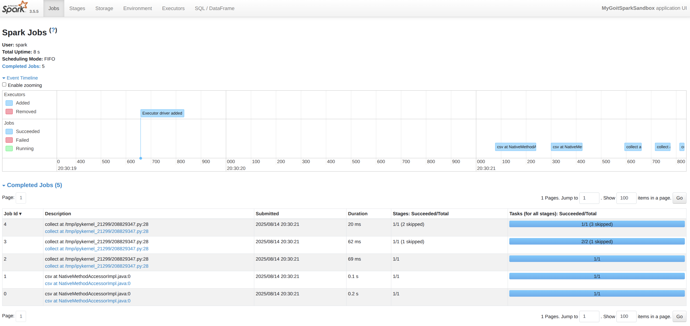
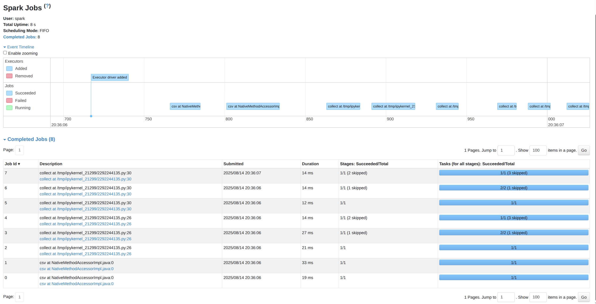
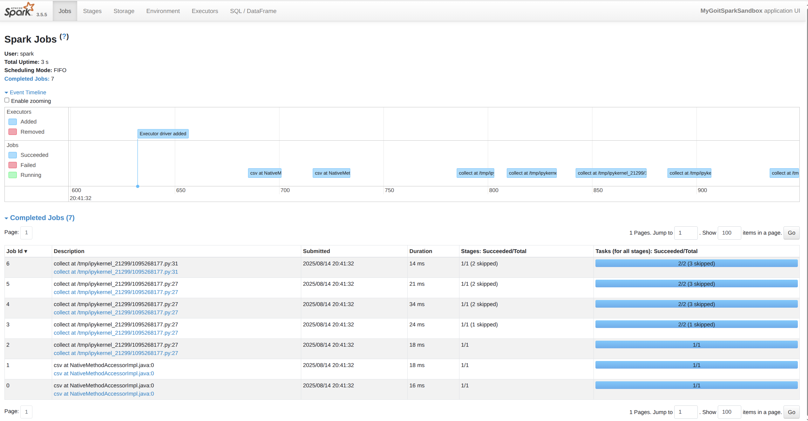

# [Домашнє завдання до теми «Apache Spark. Оптимізація та SparkUІ»](https://www.edu.goit.global/learn/25315460/26851475/26851542/homework)

## Опис домашнього завдання

### Частина 1

За основу візьмемо вже знайомий вам код і додамо проміжну дію:
```python
from pyspark.sql import SparkSession

# Створюємо сесію Spark
spark = SparkSession.builder \\
    .master("local[*]") \\
    .config("spark.sql.shuffle.partitions", "2") \\
    .appName("MyGoitSparkSandbox") \\
    .getOrCreate()

# Завантажуємо датасет
nuek_df = spark.read \\
    .option("header", "true") \\
    .option("inferSchema", "true") \\
    .csv('./nuek-vuh3.csv')

nuek_repart = nuek_df.repartition(2)

nuek_processed = nuek_repart \\
    .where("final_priority < 3") \\
    .select("unit_id", "final_priority") \\
    .groupBy("unit_id") \\
    .count()

# Ось ТУТ додано рядок
nuek_processed = nuek_processed.where("count>2")

nuek_processed.collect()

input("Press Enter to continue...5")

# Закриваємо сесію Spark
spark.stop()
```
Запустіть код. Зробіть скриншот усіх Jobs (їх має бути 5).
### Результат


### Частина 2

Додамо проміжний Action — `collect`:
```python
from pyspark.sql import SparkSession

# Створюємо сесію Spark
spark = SparkSession.builder \\
    .master("local[*]") \\
    .config("spark.sql.shuffle.partitions", "2") \\
    .appName("MyGoitSparkSandbox") \\
    .getOrCreate()

# Завантажуємо датасет
nuek_df = spark.read \\
    .option("header", "true") \\
    .option("inferSchema", "true") \\
    .csv('./nuek-vuh3.csv')

nuek_repart = nuek_df.repartition(2)

nuek_processed = nuek_repart \\
    .where("final_priority < 3") \\
    .select("unit_id", "final_priority") \\
    .groupBy("unit_id") \\
    .count()
    
# Проміжний action: collect
nuek_processed.collect()

# Ось ТУТ додано рядок
nuek_processed = nuek_processed.where("count>2")

nuek_processed.collect()

input("Press Enter to continue...5")

# Закриваємо сесію Spark
spark.stop()
```
Запустіть код. Зробіть скриншот усіх Jobs (їх має бути 8).
### Результат


 🧠 Подумайте, чому при додаванні однієї проміжної дії `nuek_processed.collect()`, отримано аж на 3 Job більше?

_Відповідь:_ виклик `collect` змусив Spark двічі повністю перерахувати весь DAG (до фільтра, після), а кожне повне виконання складається з кількох Jobs - це може бути причиною додаткових +3 Jobs.

### Частина 3

Використаємо нову для вас функцію `cache` в проміжному результаті.

 ☝🏻Функція `cache()` в `PySpark` використовується для кешування (зберігання в пам'яті) даних RDD (Resilient Distributed Dataset) або `DataFrame`. Це дозволяє прискорити виконання подальших дій (actions) або перетворень (transformations), які працюють з тими ж даними. Кешування особливо корисне, коли ви виконуєте декілька операцій на одному й тому ж RDD або `DataFrame`, оскільки PySpark не буде повторно обчислювати ті самі дані.


Як працює cache():

1. Кешування в пам'яті. Коли ви викликаєте `cache()` на RDD або `DataFrame`, дані зберігаються в пам'яті (RAM) у розподіленому вигляді на всіх вузлах кластера. Це дозволяє прискорити подальші обчислення, оскільки Spark не буде знову завантажувати або обчислювати ці дані.
2. Ліниве виконання. Виклик `cache()` не призводить до негайного виконання обчислень. Лише коли ви виконуєте дію (action), наприклад, `count()`, `collect()`, або `show()`, дані будуть обчислені та кешовані.
3. Механізм зберігання. За замовчуванням, `cache()` використовує пам'ять (Memory). Однак, якщо дані не поміщаються в пам'ять, Spark буде зберігати їх на диску.
4. Контроль над кешуванням. Коли ви використовуєте `cache()`, Spark зберігає дані з рівнем зберігання `MEMORY_ONLY`. Якщо ви хочете використовувати інші рівні зберігання, такі як `MEMORY_AND_DISK`, можна використовувати метод `persist()`.


```python
from pyspark.sql import SparkSession

# Створюємо сесію Spark
spark = SparkSession.builder \\
    .master("local[*]") \\
    .config("spark.sql.shuffle.partitions", "2") \\
    .appName("MyGoitSparkSandbox") \\
    .getOrCreate()

# Завантажуємо датасет
nuek_df = spark.read \\
    .option("header", "true") \\
    .option("inferSchema", "true") \\
    .csv('./nuek-vuh3.csv')

nuek_repart = nuek_df.repartition(2)

nuek_processed_cached = nuek_repart \\
    .where("final_priority < 3") \\
    .select("unit_id", "final_priority") \\
    .groupBy("unit_id") \\
    .count() \\
    .cache()  # Додано функцію cache

# Проміжний action: collect
nuek_processed_cached.collect()

# Ось ТУТ додано рядок
nuek_processed = nuek_processed_cached.where("count>2")

nuek_processed.collect()

input("Press Enter to continue...5")

# Звільняємо пям'ять від Dataframe
nuek_processed_cached.unpersist()

# Закриваємо сесію Spark
spark.stop()
```
Запустіть код. Зробіть скриншот усіх Jobs (їх має бути 7).


 🧠Подумайте, чому при використанні `cache()` ми зменшили кількість Job?

_Відповідь:_ запуск `cache()` другий `collect` не змушує Spark повторно читати CSV, виконувати inferSchema та робити shuffle-агрегацію — він має працювати з уже кешованими даними. Це може бути причиною зменшення кількості Jobs до 7.

### Критерії прийняття
Завантажено три скриншоти з Jobs зі сторінки SparkUI (http://localhost:4040/jobs/).

### Вихідний код
[results.ipynb](./scripts/results.ipynb)

### Репозиторій
[goit-de-hw-04](https://github.com/nickolas-z/goit-de-hw-04)
